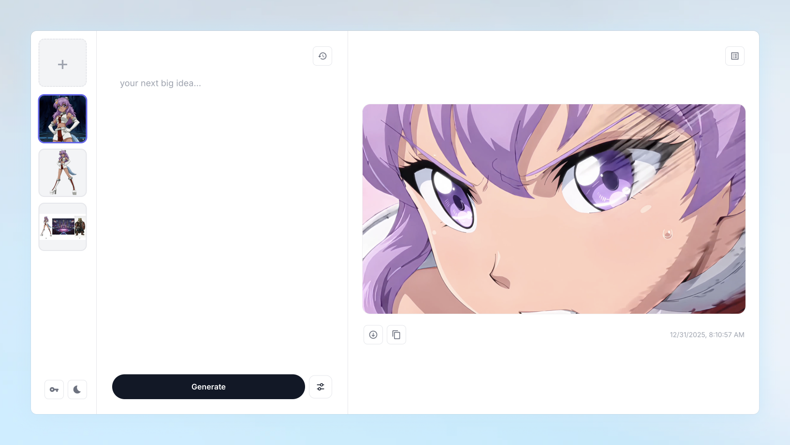

# Video Kit



[](https://opensource.org/licenses/MIT)

A minimal, high-speed web UI for generating video via the kie.ai API - designed for AI filmmakers and creators who care about staying in flow.

## Features

- **AI Video Generation** - Transform images into 5-10 second video clips using Sora 2
- **Modern UI** - Clean, OpenAI-inspired interface with dark/light theme support
- **Dual View Modes** - Switch between large embed player and list feed views
- **Real-time Tracking** - Live status updates as your videos generate
- **Prompt History** - Full-screen history view to reuse previous prompts
- **Smart Settings** - Configurable orientation, duration, and prompt modifiers
- **One-Click Downloads** - Save videos directly to your Downloads folder
- **Cost Transparency** - See estimated costs for each generation (~$0.30/5sec)

## Screenshots

### Embed View (Dark Mode)
Large centered video player with prev/next navigation for browsing generated videos.

### List View
Feed of all generations with thumbnails, status badges, and quick actions via three-dot menu.

## Tech Stack

| Layer | Technology |
|-------|------------|
| Frontend | Next.js 14 (App Router), React 18, CSS Variables |
| Backend | Next.js API Routes (Vercel Serverless) |
| Video Processing | Browser canvas (screenshots) |
| AI API | Kie.ai Sora 2 Image-to-Video, Anthropic (timestamp fixes) |
| Storage | IndexedDB (browser-local) |

## Quick Start

### Prerequisites

- Node.js 18+
- [Kie.ai API key](https://kie.ai)
- [Anthropic API key](https://console.anthropic.com) (optional, for timestamp fixes)

### Installation

```bash
# Clone the repository
git clone https://github.com/mageframe/video-kit.git
cd video-kit

# Install frontend dependencies
cd frontend
npm install
```

### Configuration

Create a `frontend/.env.local` file:

```
KIE_API_KEY=your_kie_api_key_here
ANTHROPIC_API_KEY=your_anthropic_api_key_here
```

### Running

```bash
cd frontend
npm run dev
```

**Access:**
- App: http://localhost:3000

## Usage

1. **Upload an Image** - Click the + button in the left gallery to upload a reference image
2. **Write a Prompt** - Describe what you want to happen in the video
3. **Configure Settings** - Click the settings icon to adjust:
   - **Orientation**: Landscape (16:9) or Portrait (9:16)
   - **Duration**: 10 or 15 seconds
   - **Modifiers**: No music, No crowd, No commentators, Like anime
4. **Generate** - Click the generate button and watch real-time progress
5. **View & Download** - Play your video and download with one click

## Project Structure

```
video-kit/
├── backend/               # Legacy local server (no longer used for Vercel)
├── frontend/
│   ├── src/
│   │   ├── app/            # Next.js app router + API routes
│   │   │   ├── api/         # Serverless API routes
│   │   │   └── layout.js
│   │   ├── components/     # UI components
│   │   ├── assets/icons/   # SVG icons
│   │   ├── services/
│   │   │   ├── api.js       # API helpers
│   │   │   └── storage.js   # IndexedDB storage
│   │   └── App.js
│   └── package.json
└── plan.md               # Implementation notes
```

## API Endpoints

| Method | Endpoint | Description |
|--------|----------|-------------|
| POST | `/api/kie/upload` | Upload image to Kie.ai |
| POST | `/api/kie/generate` | Submit video generation |
| GET | `/api/kie/status?taskId=...` | Check generation status |
| GET | `/api/kie/download?url=...` | Proxy download |
| POST | `/api/claude/fix-timestamps` | Fix prompt timestamps |

Full interactive documentation available at `/docs` when the backend is running.

## Cost Estimates

| Duration | Estimated Cost |
|----------|---------------|
| 5 seconds | ~$0.30 |
| 10 seconds | ~$0.60 |

*Kie.ai pricing is typically 30-50% cheaper than official APIs. Actual costs may vary.*

## Configuration Options

### Environment Variables

| Variable | Required | Default | Description |
|----------|----------|---------|-------------|
| `KIE_API_KEY` | Yes | - | Your Kie.ai API key |
| `ANTHROPIC_API_KEY` | No | - | Used for timestamp fixes |

### Video Generation Options

| Option | Values | Description |
|--------|--------|-------------|
| Orientation | `landscape`, `portrait` | 16:9 or 9:16 aspect ratio |
| Duration | `10`, `15` | Video length in seconds |
| Modifiers | Various | Append instructions to prompt |

## Known Limitations

- **No Authentication** - Designed for personal use
- **Browser Storage** - Jobs/images live in IndexedDB (clearable in the UI)
- **Single Model** - Currently only supports Sora 2
- **No Webhooks** - Uses polling for status updates

## Contributing

Contributions are welcome! Please feel free to submit a Pull Request.

1. Fork the repository
2. Create your feature branch (`git checkout -b feature/amazing-feature`)
3. Commit your changes (`git commit -m 'Add amazing feature'`)
4. Push to the branch (`git push origin feature/amazing-feature`)
5. Open a Pull Request

## License

This project is licensed under the MIT License - see the [LICENSE](LICENSE) file for details.

## Acknowledgments

- [Kie.ai](https://kie.ai) - AI API aggregation platform
- [FastAPI](https://fastapi.tiangolo.com/) - Modern Python web framework
- [React](https://react.dev/) - UI library
- [OpenCV](https://opencv.org/) - Video processing
